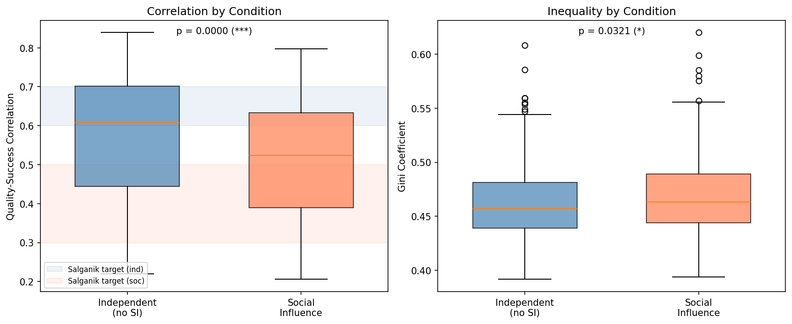
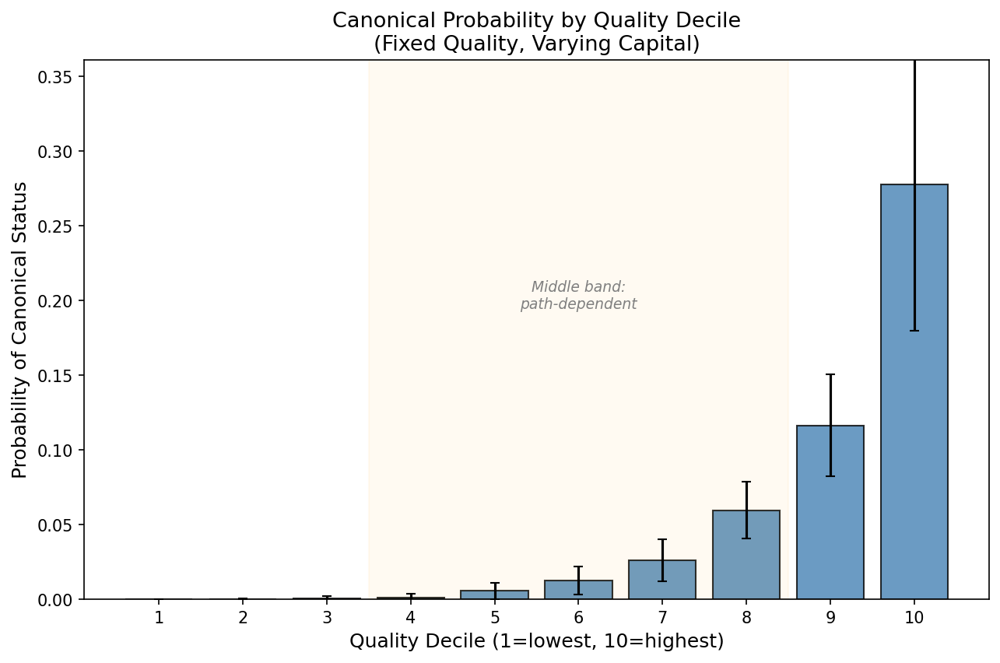
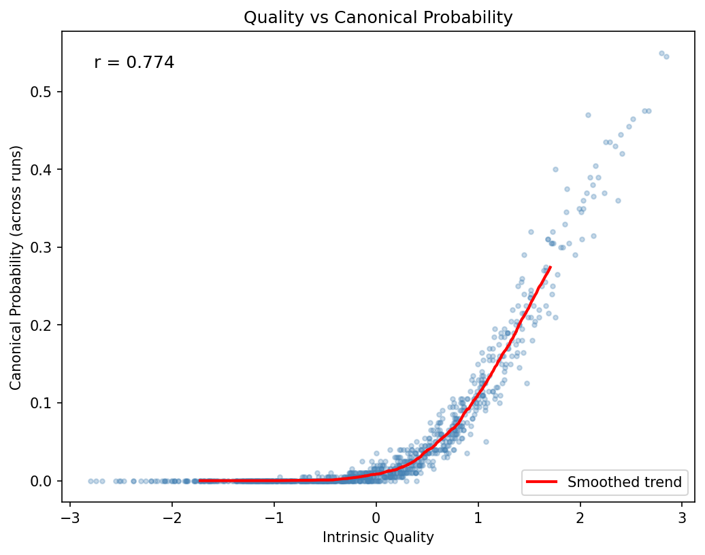
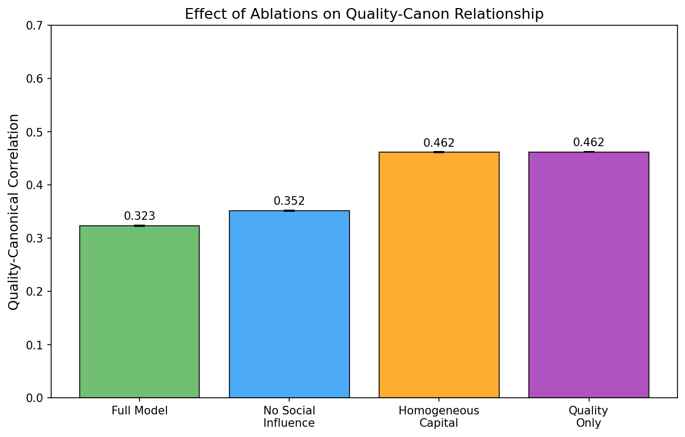
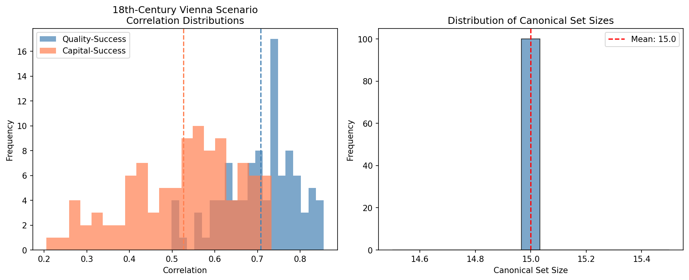
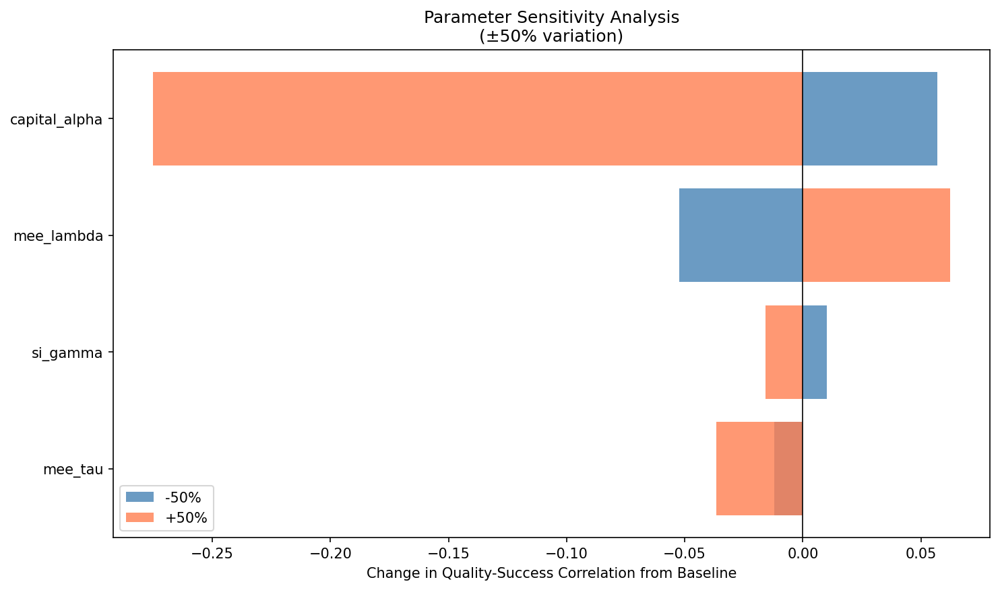

# Manufacturing Taste

**Status**: 🟡 MVP | **Mode**: 🔀 Hybrid | **Updated**: 2026-03-26

*A computational investigation into why we remember the art we remember---and whether the artists we forgot were actually any worse.*

---

## The Question

Why do we listen to Mozart and not his contemporaries? The standard answer is quality: Mozart wrote better music, and over time the cream rose to the top. This is a comforting narrative. It implies that the cultural canon---the list of "great" works we teach, perform, and celebrate---is a reliable record of genuine excellence.

But there is another possibility. What if who we remember has less to do with who was best, and more to do with who had money, connections, and luck? What if the canon is not a filter that catches the best and lets the rest through, but a funnel that amplifies whoever happened to get heard first?

This project uses computer simulation to investigate that question. We build a model of how cultural markets work---how artists get exposure, how audiences form preferences, and how some works become "canonical" while others are forgotten---and then we run it thousands of times under different conditions to see how much of canonical status can be explained by quality versus everything else.

The full technical treatment is in [`paper/paper.pdf`](paper/paper.pdf). This README explains the project for a general audience.

---

## Three Competing Stories

We test three hypotheses about how canons form. Each tells a different story about the relationship between quality and fame.

### Story 1: The Cream Rises (Meritocratic Filtering)

The optimistic view. The works we remember are simply the best works. Money and connections might give someone a temporary boost, but over decades and centuries, genuine quality wins out. If you could somehow replay history with different initial conditions---different patrons, different funding---you would end up with roughly the same canon.

**If this is true**, then quality and canonical status should be almost perfectly correlated, and reshuffling resources should not change the outcome.

### Story 2: Money Writes History (Capital-Exposure Loop)

The pessimistic view. Success is mostly about who gets heard first. An artist with wealthy patrons gets performed; audiences grow to like what they hear repeatedly (a well-documented psychological phenomenon called the *mere exposure effect*); that popularity is interpreted as evidence of quality; and institutions---concert halls, universities, streaming algorithms---lock in those choices for future generations. Quality is almost irrelevant.

**If this is true**, then initial capital (money, connections, institutional access) should predict canonical status far better than quality does.

### Story 3: Floors and Ceilings (Bounded Path Dependence)

The nuanced view. Both of the above are partly right. Truly terrible work never succeeds no matter how much money backs it. Truly transcendent work sometimes breaks through despite every obstacle. But for the vast majority of artists in the middle---the "good but not obviously once-in-a-generation" group---whether they become famous or forgotten depends mainly on luck, money, and timing.

**If this is true**, then quality should matter at the extremes but be overwhelmed by capital and randomness in the broad middle.

This is the hypothesis our simulations support.

---

## How We Tested It

### The Model

We built an agent-based simulation with three types of actors:

- **Producers** (think: composers, musicians, artists). Each has an *intrinsic quality*---how good their work actually is---and *capital*---how much money, patronage, and institutional access they start with. Quality and capital are assigned independently: being wealthy doesn't make you talented, and being talented doesn't make you wealthy.

- **Consumers** (think: audiences, listeners). They encounter works, form opinions, and are influenced by both the actual quality of what they hear and by social signals (what's popular, what others are listening to).

- **Gatekeepers** (think: critics, curators, playlist editors). They decide who gets broad exposure, based on their own (potentially biased) perceptions.

### The Mechanisms

The model incorporates three psychological and economic phenomena that are individually well-documented but whose combined effects on cultural canons have not been quantified:

**1. The Mere Exposure Effect.** We tend to like things we've encountered before. A song that plays on the radio ten times starts to feel "catchy" even if it didn't grab you the first time. This is not about learning to appreciate complexity---it happens with nonsense syllables, abstract shapes, and faces of strangers. In our model, this means artists who get more initial airtime develop an artificial quality advantage: audiences genuinely perceive their work as better simply because it is more familiar. The effect peaks at moderate exposure and reverses with overexposure (the "I'm sick of that song" feeling).

**2. Social Influence.** We look at what others are consuming and use it as a shortcut for deciding what's good. Bestseller lists, download counts, "trending" labels, and concert attendance all function as social signals. This creates a snowball effect: a small early lead gets amplified as more people follow the crowd. In the famous [Salganik MusicLab experiment](https://doi.org/10.1126/science.1121066) (2006), the same song could rank 1st in one "world" and 40th in another, purely because of random early differences in who happened to download it first.

**3. Cumulative Advantage (The Matthew Effect).** "The rich get richer." An artist whose first album sells well gets a bigger marketing budget for the second, better tour slots, more press coverage, and more prominent playlist placement---all of which make the second album more likely to succeed too, regardless of whether it's actually better. The sociologist Robert Merton named this after the biblical verse: *"For unto every one that hath shall be given."* Small initial differences---which may be due to luck, timing, or money rather than talent---get magnified into enormous gaps over time.

### The Experiments

We ran five experiments, each addressing a different aspect of the question. Each experiment involved hundreds of simulation runs (360+ per condition for the main comparisons), with formal statistical power analysis to ensure our results are reliable.

---

## The Results

### Experiment 1: Does Social Influence Weaken the Quality-Success Link?

**Setup:** We ran two versions of the simulation side by side. In the "independent" version, each listener evaluates works entirely on their own---no charts, no download counts, no "trending" labels. In the "social" version, listeners can see what others are consuming.

**Result:** When social influence is active, the correlation between quality and success drops from r = 0.57 to r = 0.51 (p < 0.0001, 360 runs per condition).



**What this means:** In a world where nobody could see what anyone else was listening to, quality would be a moderately good predictor of success. Not perfect---there's still randomness, and capital still matters---but the best works would tend to do better. But in the world we actually live in, where every Top 40 chart, every "Customers Also Bought" recommendation, and every view count nudges people toward what's already popular, the link between actual quality and commercial success gets weaker. A mediocre song that gets lucky early can ride the wave of social proof to stardom, while an equally good song that starts slow may never recover.

### Experiment 2: If We Replayed History, Would We Get the Same Canon?

**Setup:** We gave every simulated artist the same talent level, then reshuffled only their resources---who had wealthy patrons and who didn't---and ran the simulation 200 times.

**Result:** The "counterfactual distance" was 0.88 on a 0-to-1 scale, where 0 means "identical canon every time" and 1 means "completely different canons every time." Only artists in the top 10% of quality had more than a 25% chance of achieving canonical status across different resource allocations.



**What this means:** When we hold talent constant and only change who gets funded, we get almost entirely different canons. This is the simulation equivalent of asking: *"If the Esterh&aacute;zy family had hired a different Kapellmeister instead of Haydn, would we still know Haydn's name?"* Our model says: probably not. The top decile---the truly exceptional---have a meaningful shot regardless, but it's still only about 1 in 4. For everyone else, canonical status is effectively a lottery determined by who got funded.



### Experiment 3: What Matters More---Unequal Money or Herd Behavior?

**Setup:** We ran the simulation under four conditions, systematically removing one factor at a time, like a doctor isolating which variable causes a symptom:
1. Full model (everything active)
2. No social influence (people judge independently)
3. Equal capital (everyone starts with the same resources)
4. Quality only (no social influence, no capital inequality)

**Result:**

| Condition | Quality-Canon Correlation |
|---|---|
| Full model (everything active) | 0.32 |
| No social influence | 0.35 |
| Equal capital | 0.46 |
| Quality only | 0.46 |



**What this means:** Turning off social influence barely helps (0.32 to 0.35). But equalizing everyone's starting resources jumps the quality-canon correlation from 0.32 to 0.46---a 44% improvement. The biggest distortion is not that audiences follow trends; it's that some artists never get heard in the first place because they lack the resources to get their work in front of audiences. A modern analogy: the problem is not that listeners blindly follow Spotify playlists, but that only major-label artists get on those playlists to begin with.

### Experiment 4: What Would This Look Like in 18th-Century Vienna?

**Setup:** We built a stylized model of the classical music world circa 1750: a small pool of ~300 active composers, a handful of very wealthy patrons (like the Esterh&aacute;zy and Habsburg courts), strong word-of-mouth dynamics, and no recording technology.

**Result:** Counterfactual distance of 0.97 (near-maximum). Only 2.5% of canonical composers are shared between any two alternate histories.



**What this means:** If you could rewind to 1750 and randomly reassign which composers got which court positions, the names we teach in music history classes today would be almost entirely different. The composers in our actual canon were very likely excellent---you had to be good to compete for a court position---but dozens of equally excellent composers were lost to history because they drew the short straw in the patronage lottery. This is what we mean by the canon being "manufactured": not that the winners were bad, but that the losers were not meaningfully worse.

### Experiment 5: How Robust Are These Findings?

**Setup:** We varied every model parameter by &plusmn;50% to see which assumptions matter most.

**Result:**



**What this means:** The single most important factor is *how steeply money converts into attention*. If doubling your marketing budget more than doubles your audience, then the rich get richer very quickly and quality barely matters. If doubling your budget less than doubles your audience, quality has more room to shine through. This isn't just a modeling choice---it corresponds to a real question about the world. In an industry where a major label can buy a front-page Spotify placement reaching 50 million listeners while an independent artist's self-promotion reaches 500, the capital-to-exposure curve is extremely steep, and our model predicts that quality will have very little to do with who becomes famous.

---

## The Bottom Line

Our simulations support **Story 3 (Bounded Path Dependence)**. Quality acts as a loose filter: it sets a floor below which you cannot succeed and a ceiling above which you are likely to. But the vast middle ground---where most artists live---is dominated by money, luck, and whoever happened to catch the public's attention first.

For the specific case of the Western classical music canon, our historical simulations suggest that replaying the 18th century with different patronage allocations would produce an **almost entirely different set of "great composers."** The composers we celebrate were almost certainly excellent. But so were the dozens of contemporaries we have never heard of.

This carries real implications:

- **For how we talk about art:** When someone says "Bach is the greatest composer who ever lived," a more accurate statement would be: "Bach is the greatest composer who ever lived *among those who had the resources to be heard, published, and preserved.*"

- **For today's cultural industries:** The mechanisms we model---exposure bias, social influence, cumulative advantage---are, if anything, *stronger* in the age of algorithmic recommendations, where feedback loops operate in hours rather than decades.

- **For policy:** Our model suggests the single highest-leverage intervention is not teaching audiences to be better judges (they already are, within the limits of what they're exposed to), but ensuring a wider range of artists gets initial exposure. Blind auditions for orchestras, which were widely adopted in the 1970s--80s, are a real-world proof of concept: when the screen went up, the proportion of women hired by major US orchestras increased from 5% to 25%. The talent was always there; the barrier was exposure.

---

## Assumptions and Limitations

This is a simulation, not a time machine. Our results depend on modeling choices, and we want to be transparent about what we assumed and what we cannot know.

**What we assume:**
- Quality is a real, stable property of artistic works that exists independently of who hears them. This is philosophically debatable---if "quality" is partly constituted by social processes, our entire decomposition may be ill-posed.
- Quality and initial capital are independent. In reality, wealthy families may provide better training, so some correlation is plausible. This would make our estimates of path dependence *conservative* (the true role of quality would be even smaller).
- The mere exposure effect, social influence, and cumulative advantage operate as described in the psychology and economics literature. The individual mechanisms are well-documented; what is novel here is quantifying their *combined* effect on canon formation.

**What we cannot know:**
- Whether the specific parameter values in our model match historical reality. We calibrate against the Salganik MusicLab experiment (the best available data), but those were American teenagers evaluating pop songs over weeks, not 18th-century European aristocrats evaluating orchestral music over decades.
- Whether there are important mechanisms we left out---genre formation, critical discourse, technological change in distribution, cultural politics. Our model is necessarily a simplification.
- Whether quality itself is the right concept. If "good art" is partly art that has been widely shared and discussed, then separating quality from exposure may be impossible in principle.

**What we are confident about:**
- The *direction* of the effects is robust: capital inequality reduces the quality-canon link, social influence amplifies inequality, and canonical outcomes are highly sensitive to initial conditions. These findings hold across a wide range of parameter values (see Experiment 5).
- The *mechanisms* we model are real and well-documented individually. Our contribution is showing what happens when they interact at scale over time.

---

## Technical Details

### Statistical Rigor

Every experiment includes formal power analysis. We computed the minimum number of simulation runs needed to detect effects at conventional significance levels (alpha = 0.05, power = 0.80) and ran at least that many. Key sample sizes:

| Experiment | Runs | Effect Size (Cohen's d) | Power |
|---|---|---|---|
| Salganik comparison | 360 per condition | 0.44 | > 0.99 |
| Counterfactual | 200 | large (CF dist = 0.88) | > 0.99 |
| Variance decomposition | 300 per condition | --- | --- |
| Historical scenario | 100 | large (CF dist = 0.97) | > 0.99 |
| Sensitivity | 100 per level | 0.17 -- 2.50 | varies |

### Installation and Reproduction

```bash
# Clone and install
git clone https://github.com/k1monfared/manufacturing_taste.git
cd manufacturing_taste
pip install -e ".[dev]"

# Run tests (90 tests, ~8 minutes)
python -m pytest tests/ -q

# Regenerate analysis from existing raw data
python scripts/combine_batches.py --output results/analysis.json
python scripts/generate_analysis.py

# Run new simulations in parallel (uses multiple CPU cores)
python scripts/run_parallel.py --experiment all --n-runs 100 --workers 10
```

### Project Structure

```
manufacturing_taste/
├── src/cultural_market/     # Simulation engine (10 modules)
│   ├── agents.py            # Producer, Consumer, Gatekeeper
│   ├── market.py            # Main simulation loop
│   ├── mechanisms.py        # MEE, social influence, exposure functions
│   ├── experiments.py       # 5 experiment runners
│   ├── power_analysis.py    # Statistical power calculations
│   └── ...
├── tests/                   # 90 unit tests
├── paper/                   # Academic paper (LaTeX + PDF)
├── results/                 # Figures, tables, analysis
├── scripts/                 # CLI tools for running experiments
└── notebooks/               # Jupyter exploration notebooks
```

### Paper

The full academic paper with equations, methodology, and technical discussion is at [`paper/paper.pdf`](paper/paper.pdf).

---

## License

MIT License - see [LICENSE](LICENSE) for details.
